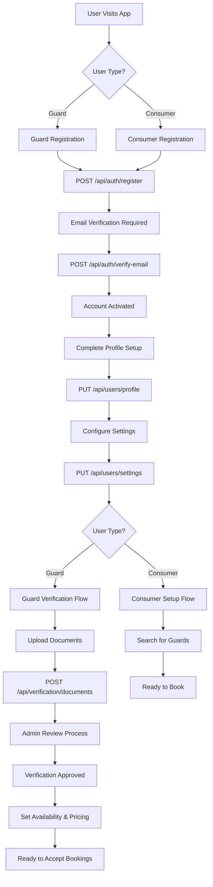
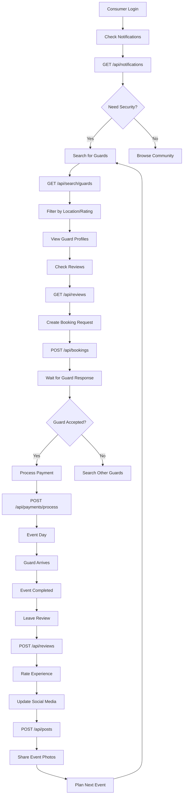
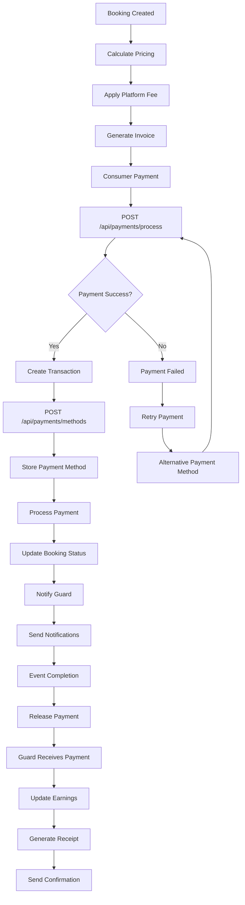
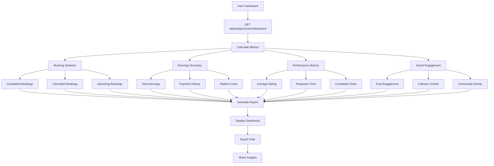
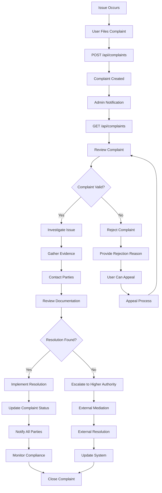

# Security Guard App - Visual Flow Diagrams

## 🔐 **Complete User Registration & Onboarding Flow**



## 🛡️ **Guard Complete Workflow**

```mermaid
graph TD
    A[Guard Login] --> B[Check Notifications]
    B --> C[GET /api/notifications]
    
    C --> D{New Bookings?}
    D -->|Yes| E[Review Booking Requests]
    D -->|No| F[Check Social Feed]
    
    E --> G[GET /api/bookings]
    G --> H{Accept Booking?}
    H -->|Yes| I[POST /api/bookings/{id}/confirm]
    H -->|No| J[POST /api/bookings/{id}/cancel]
    
    I --> K[Prepare for Event]
    K --> L[Arrive at Location]
    L --> M[POST /api/bookings/{id}/complete]
    
    M --> N[Update Social Media]
    N --> O[POST /api/posts]
    O --> P[Share Work Updates]
    
    P --> Q[Check Earnings]
    Q --> R[GET /api/analytics/user/dashboard]
    R --> S[Manage Payments]
    S --> T[GET /api/payments/methods]
    
    T --> U[Engage Community]
    U --> V[Like/Comment on Posts]
    V --> W[Build Professional Network]
    
    W --> X[Wait for Next Booking]
    X --> A
```

## 👥 **Consumer Complete Workflow**



## 🔄 **Social Interaction Flow**

```mermaid
graph TD
    A[User Login] --> B[Check Feed]
    B --> C[GET /api/posts]
    
    C --> D{Interact with Post?}
    D -->|Like| E[POST /api/posts/{id}/like]
    D -->|Comment| F[POST /api/posts/{id}/comments]
    D -->|Share| G[Share to External]
    
    E --> H[Update Like Count]
    F --> I[Add Comment]
    G --> J[External Share]
    
    H --> K[Continue Browsing]
    I --> K
    J --> K
    
    K --> L{Create Own Post?}
    L -->|Yes| M[POST /api/posts]
    L -->|No| N[Follow Users]
    
    M --> O[Add Media]
    O --> P[POST /api/posts/{id}/media]
    P --> Q[Publish Post]
    
    N --> R[Follow Other Users]
    R --> S[Build Network]
    S --> T[Get Notifications]
    T --> U[GET /api/notifications]
    
    U --> V[Engage with Notifications]
    V --> W[Mark as Read]
    W --> X[POST /api/notifications/mark-read]
    
    X --> Y[Continue Social Activity]
    Y --> B
```

## 💰 **Payment & Transaction Flow**



## 🔍 **Verification & Admin Flow**

```mermaid
graph TD
    A[User Submits Document] --> B[POST /api/verification/documents]
    B --> C[Document Stored]
    C --> D[Status: Pending]
    
    D --> E[Admin Notification]
    E --> F[GET /api/verification/admin/pending]
    F --> G[Review Document]
    
    G --> H{Document Valid?}
    H -->|Yes| I[POST /api/verification/admin/{id}/approve]
    H -->|No| J[POST /api/verification/admin/{id}/reject]
    
    I --> K[Status: Approved]
    J --> L[Status: Rejected]
    
    K --> M[User Notification]
    L --> N[Rejection Reason]
    
    M --> O[User Can Accept Bookings]
    N --> P[User Must Resubmit]
    
    P --> Q[Upload New Document]
    Q --> B
    
    O --> R[Background Check Process]
    R --> S[POST /api/verification/background-checks]
    S --> T[Third-party Verification]
    T --> U[Results Stored]
    U --> V[Verification Complete]
```

## 📊 **Analytics & Reporting Flow**



## 🚨 **Dispute Resolution Flow**



These flow diagrams provide a comprehensive visual representation of all user journeys, API interactions, and business processes in the security guard freelancing platform.
