# Security Guard App - Entity Relationship Diagram

## Complete ER Diagram

```mermaid
erDiagram
    %% Core User Tables
    USERS {
        int id PK
        varchar email UK
        text password_hash
        varchar phone_number UK
        boolean is_active
        boolean is_verified
        timestamp last_login
        timestamp created_at
        timestamp updated_at
    }

    PROFILES {
        int id PK
        int user_id FK
        varchar first_name
        varchar last_name
        varchar full_name
        date date_of_birth
        varchar gender
        text bio
        text profile_picture_url
        text cover_photo_url
        varchar address_line1
        varchar address_line2
        varchar city
        varchar state
        varchar postal_code
        varchar country
        decimal latitude
        decimal longitude
        int location_accuracy
        varchar user_type
        varchar status
        int years_experience
        text[] certifications
        text[] languages_spoken
        jsonb availability_schedule
        int max_travel_distance
        varchar emergency_contact_name
        varchar emergency_contact_phone
        text linkedin_url
        varchar instagram_handle
        varchar twitter_handle
        timestamp created_at
        timestamp updated_at
    }

    USER_SETTINGS {
        int id PK
        int user_id FK
        boolean email_notifications
        boolean sms_notifications
        boolean push_notifications
        boolean marketing_emails
        varchar profile_visibility
        boolean location_sharing
        boolean show_online_status
        boolean two_factor_enabled
        varchar two_factor_method
        boolean login_notifications
        varchar language
        varchar timezone
        varchar currency
        varchar distance_unit
        timestamp created_at
        timestamp updated_at
    }

    %% Verification System
    VERIFICATION_DOCUMENT_TYPES {
        int id PK
        varchar name UK
        text description
        boolean required_for_guards
        boolean required_for_consumers
        boolean is_active
    }

    VERIFICATIONS {
        int id PK
        int user_id FK
        int document_type_id FK
        varchar document_name
        text document_url
        varchar document_hash
        int file_size
        varchar mime_type
        varchar status
        int verified_by FK
        text verification_notes
        timestamp verified_at
        timestamp expires_at
        varchar document_number
        varchar issuing_authority
        date issued_date
        date expiry_date
        timestamp submitted_at
        timestamp updated_at
    }

    BACKGROUND_CHECKS {
        int id PK
        int user_id FK
        varchar check_type
        varchar provider
        varchar reference_id
        varchar status
        jsonb result_data
        timestamp initiated_at
        timestamp completed_at
        timestamp expires_at
    }

    %% Social Features
    POSTS {
        int id PK
        int user_id FK
        text content
        varchar post_type
        varchar location_name
        decimal latitude
        decimal longitude
        varchar visibility
        boolean allow_comments
        boolean allow_sharing
        int like_count
        int comment_count
        int share_count
        boolean is_flagged
        text flagged_reason
        int moderated_by FK
        timestamp moderated_at
        timestamp created_at
        timestamp updated_at
    }

    POST_MEDIA {
        int id PK
        int post_id FK
        text media_url
        varchar media_type
        text thumbnail_url
        int file_size
        int duration
        int width
        int height
        int sort_order
        timestamp created_at
    }

    POST_LIKES {
        int id PK
        int post_id FK
        int user_id FK
        timestamp created_at
    }

    POST_COMMENTS {
        int id PK
        int post_id FK
        int user_id FK
        int parent_comment_id FK
        text content
        boolean is_edited
        timestamp edited_at
        int like_count
        timestamp created_at
        timestamp updated_at
    }

    COMMENT_LIKES {
        int id PK
        int comment_id FK
        int user_id FK
        timestamp created_at
    }

    USER_FOLLOWS {
        int id PK
        int follower_id FK
        int following_id FK
        timestamp created_at
    }

    %% Booking System
    EVENT_TYPES {
        int id PK
        varchar name UK
        text description
        text icon_url
        boolean is_active
        timestamp created_at
    }

    BOOKINGS {
        int id PK
        varchar booking_reference UK
        int guard_id FK
        int consumer_id FK
        int event_type_id FK
        varchar event_name
        text event_description
        varchar venue_name
        varchar address_line1
        varchar address_line2
        varchar city
        varchar state
        varchar postal_code
        varchar country
        decimal latitude
        decimal longitude
        timestamp start_datetime
        timestamp end_datetime
        decimal duration_hours
        decimal hourly_rate
        decimal total_amount
        decimal platform_fee
        decimal final_amount
        varchar status
        text special_requirements
        boolean uniform_required
        boolean equipment_provided
        text consumer_notes
        text guard_notes
        timestamp created_at
        timestamp confirmed_at
        timestamp started_at
        timestamp completed_at
        timestamp cancelled_at
        int cancelled_by FK
        text cancellation_reason
    }

    BOOKING_STATUS_HISTORY {
        int id PK
        int booking_id FK
        varchar old_status
        varchar new_status
        int changed_by FK
        text reason
        timestamp changed_at
    }

    %% Pricing System
    PRICING_ZONES {
        int id PK
        varchar name
        varchar city
        varchar state
        varchar country
        decimal center_latitude
        decimal center_longitude
        int radius_miles
        boolean is_active
        timestamp created_at
    }

    GUARD_PRICING {
        int id PK
        int guard_id FK
        int pricing_zone_id FK
        decimal base_hourly_rate
        int minimum_hours
        int maximum_hours
        decimal weekend_multiplier
        decimal holiday_multiplier
        decimal night_shift_multiplier
        decimal emergency_multiplier
        decimal corporate_event_adjustment
        decimal private_event_adjustment
        decimal security_event_adjustment
        boolean is_available
        timestamp available_from
        timestamp available_until
        timestamp created_at
        timestamp updated_at
    }

    PRICING_FACTORS {
        int id PK
        varchar factor_name UK
        varchar factor_type
        decimal multiplier
        boolean is_active
        timestamp created_at
    }

    %% Payment System
    PAYMENT_METHODS {
        int id PK
        int user_id FK
        varchar method_type
        varchar provider
        varchar provider_method_id
        boolean is_default
        boolean is_verified
        varchar last_four_digits
        varchar card_brand
        int expiry_month
        int expiry_year
        varchar bank_name
        varchar account_type
        timestamp created_at
        timestamp updated_at
    }

    TRANSACTIONS {
        int id PK
        varchar transaction_reference UK
        int booking_id FK
        int payer_id FK
        int payee_id FK
        decimal amount
        varchar currency
        decimal platform_fee
        decimal processing_fee
        decimal total_amount
        varchar transaction_type
        int payment_method_id FK
        varchar provider_transaction_id
        varchar status
        text description
        jsonb metadata
        int initiated_by FK
        timestamp created_at
        timestamp updated_at
    }

    TRANSACTION_STATUS_HISTORY {
        int id PK
        int transaction_id FK
        varchar old_status
        varchar new_status
        int changed_by FK
        text reason
        timestamp changed_at
    }

    %% Review System
    REVIEWS {
        int id PK
        int reviewer_id FK
        int reviewed_user_id FK
        int booking_id FK
        int overall_rating
        int punctuality_rating
        int professionalism_rating
        int communication_rating
        text review_text
        boolean is_public
        boolean is_anonymous
        boolean is_flagged
        text flagged_reason
        int moderated_by FK
        timestamp moderated_at
        timestamp created_at
        timestamp updated_at
    }

    REVIEW_RESPONSES {
        int id PK
        int review_id FK
        int responder_id FK
        text response_text
        timestamp created_at
        timestamp updated_at
    }

    REVIEW_VOTES {
        int id PK
        int review_id FK
        int user_id FK
        boolean is_helpful
        timestamp created_at
    }

    %% Complaint System
    COMPLAINT_CATEGORIES {
        int id PK
        varchar name UK
        text description
        boolean is_active
    }

    COMPLAINTS {
        int id PK
        varchar complaint_reference UK
        int complainant_id FK
        int defendant_id FK
        int booking_id FK
        int category_id FK
        varchar title
        text description
        varchar priority
        varchar status
        text resolution
        int resolved_by FK
        timestamp resolved_at
        timestamp created_at
        timestamp updated_at
    }

    COMPLAINT_UPDATES {
        int id PK
        int complaint_id FK
        int user_id FK
        text message
        boolean is_internal
        timestamp created_at
    }

    %% Notification System
    NOTIFICATION_TYPES {
        int id PK
        varchar name UK
        text description
        text template_subject
        text template_body
        boolean is_active
    }

    NOTIFICATIONS {
        int id PK
        int user_id FK
        int type_id FK
        varchar title
        text message
        jsonb data
        boolean is_read
        timestamp read_at
        boolean sent_email
        boolean sent_sms
        boolean sent_push
        timestamp created_at
    }

    %% System Configuration
    APP_SETTINGS {
        int id PK
        varchar setting_key UK
        text setting_value
        varchar setting_type
        text description
        boolean is_public
        int updated_by FK
        timestamp updated_at
    }

    %% Relationships
    USERS ||--|| PROFILES : "has"
    USERS ||--|| USER_SETTINGS : "has"
    USERS ||--o{ VERIFICATIONS : "submits"
    USERS ||--o{ BACKGROUND_CHECKS : "has"
    USERS ||--o{ POSTS : "creates"
    USERS ||--o{ POST_LIKES : "likes"
    USERS ||--o{ POST_COMMENTS : "comments"
    USERS ||--o{ COMMENT_LIKES : "likes"
    USERS ||--o{ USER_FOLLOWS : "follows"
    USERS ||--o{ USER_FOLLOWS : "followed_by"
    USERS ||--o{ BOOKINGS : "guards"
    USERS ||--o{ BOOKINGS : "consumers"
    USERS ||--o{ BOOKING_STATUS_HISTORY : "changes"
    USERS ||--o{ GUARD_PRICING : "sets"
    USERS ||--o{ PAYMENT_METHODS : "has"
    USERS ||--o{ TRANSACTIONS : "pays"
    USERS ||--o{ TRANSACTIONS : "receives"
    USERS ||--o{ TRANSACTION_STATUS_HISTORY : "changes"
    USERS ||--o{ REVIEWS : "writes"
    USERS ||--o{ REVIEWS : "receives"
    USERS ||--o{ REVIEW_RESPONSES : "responds"
    USERS ||--o{ REVIEW_VOTES : "votes"
    USERS ||--o{ COMPLAINTS : "files"
    USERS ||--o{ COMPLAINTS : "defends"
    USERS ||--o{ COMPLAINT_UPDATES : "updates"
    USERS ||--o{ NOTIFICATIONS : "receives"
    USERS ||--o{ APP_SETTINGS : "updates"

    VERIFICATION_DOCUMENT_TYPES ||--o{ VERIFICATIONS : "categorizes"
    POSTS ||--o{ POST_MEDIA : "contains"
    POSTS ||--o{ POST_LIKES : "receives"
    POSTS ||--o{ POST_COMMENTS : "has"
    POST_COMMENTS ||--o{ POST_COMMENTS : "replies_to"
    POST_COMMENTS ||--o{ COMMENT_LIKES : "receives"
    EVENT_TYPES ||--o{ BOOKINGS : "categorizes"
    BOOKINGS ||--o{ BOOKING_STATUS_HISTORY : "tracks"
    PRICING_ZONES ||--o{ GUARD_PRICING : "defines"
    BOOKINGS ||--o{ TRANSACTIONS : "generates"
    PAYMENT_METHODS ||--o{ TRANSACTIONS : "uses"
    TRANSACTIONS ||--o{ TRANSACTION_STATUS_HISTORY : "tracks"
    BOOKINGS ||--o{ REVIEWS : "generates"
    REVIEWS ||--o{ REVIEW_RESPONSES : "receives"
    REVIEWS ||--o{ REVIEW_VOTES : "receives"
    COMPLAINT_CATEGORIES ||--o{ COMPLAINTS : "categorizes"
    BOOKINGS ||--o{ COMPLAINTS : "generates"
    COMPLAINTS ||--o{ COMPLAINT_UPDATES : "tracks"
    NOTIFICATION_TYPES ||--o{ NOTIFICATIONS : "categorizes"
```

## Key Relationships Summary

### **Core User Relationships**
- **USERS** → **PROFILES**: One-to-one (each user has one profile)
- **USERS** → **USER_SETTINGS**: One-to-one (each user has one settings record)

### **Social Features**
- **USERS** → **POSTS**: One-to-many (users can create multiple posts)
- **POSTS** → **POST_MEDIA**: One-to-many (posts can have multiple media files)
- **POSTS** → **POST_LIKES**: One-to-many (posts can have multiple likes)
- **POSTS** → **POST_COMMENTS**: One-to-many (posts can have multiple comments)
- **USER_FOLLOWS**: Many-to-many self-referencing (users can follow other users)

### **Booking System**
- **USERS** → **BOOKINGS**: One-to-many (guards and consumers can have multiple bookings)
- **EVENT_TYPES** → **BOOKINGS**: One-to-many (event types can have multiple bookings)
- **BOOKINGS** → **BOOKING_STATUS_HISTORY**: One-to-many (bookings can have multiple status changes)

### **Pricing & Payments**
- **USERS** → **GUARD_PRICING**: One-to-many (guards can have multiple pricing profiles)
- **PRICING_ZONES** → **GUARD_PRICING**: One-to-many (zones can have multiple guard pricing)
- **BOOKINGS** → **TRANSACTIONS**: One-to-many (bookings can generate multiple transactions)
- **PAYMENT_METHODS** → **TRANSACTIONS**: One-to-many (payment methods can be used in multiple transactions)

### **Review System**
- **BOOKINGS** → **REVIEWS**: One-to-many (bookings can have multiple reviews)
- **USERS** → **REVIEWS**: One-to-many (users can write multiple reviews)
- **REVIEWS** → **REVIEW_RESPONSES**: One-to-many (reviews can have multiple responses)

### **Complaint System**
- **BOOKINGS** → **COMPLAINTS**: One-to-many (bookings can generate multiple complaints)
- **USERS** → **COMPLAINTS**: One-to-many (users can file multiple complaints)
- **COMPLAINTS** → **COMPLAINT_UPDATES**: One-to-many (complaints can have multiple updates)

### **Verification System**
- **USERS** → **VERIFICATIONS**: One-to-many (users can have multiple verifications)
- **VERIFICATION_DOCUMENT_TYPES** → **VERIFICATIONS**: One-to-many (document types can have multiple verifications)

This ER diagram shows the complete structure of your security guard freelancing app database, including all relationships and foreign key constraints.
